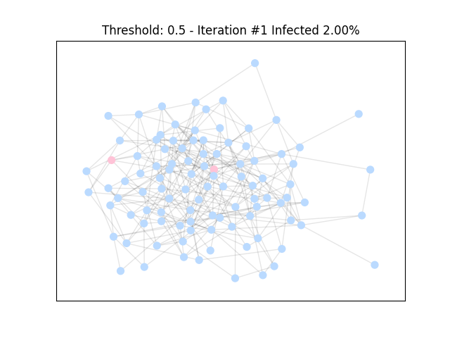
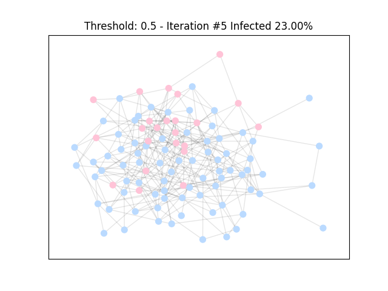
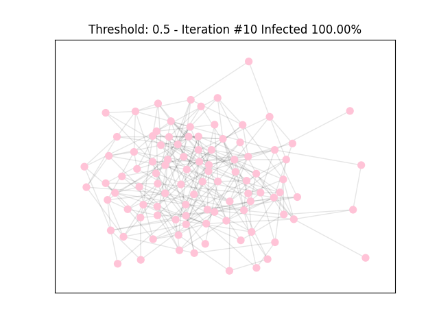

# ORIE6125 Project - Network Contagion Under Linear Threshold Model
This repo contains the simulation pipeline for network contagion under linear threshold model in the Gnp graph. Given a network topology, the pipeline can generate single or multiple contagion trajectories. Simulating multiple trajectories can be conducted more efficiently by parallelization. Animation of a particular contagion trajectory is also implemented. `demo.py` includes example commands to use the simulation pipeline.

## Usage
Simulation of a single trajectory:
```python
from utils.linear_threshold import LinearThreshold

linear_threshold = LinearThreshold()
infected, N, z = linear_threshold.trial(n = 1000, all = False)
print(infected, N, z)
```

Simulation of multiple trajectories using 2 CPUs:
```python
from utils.linear_threshold import LinearThreshold

linear_threshold = LinearThreshold()
results = linear_threshold.multi_trials(n = 1000, all = False, num_trials = 10, n_cpu = 2)
print(results)
```

Animation:
```python
from utils.linear_threshold import LinearThreshold

linear_threshold = LinearThreshold()
linear_threshold.animate(thres_up = 0.5, n = 100)
```
<p float="left">
  
   
  
</p>
